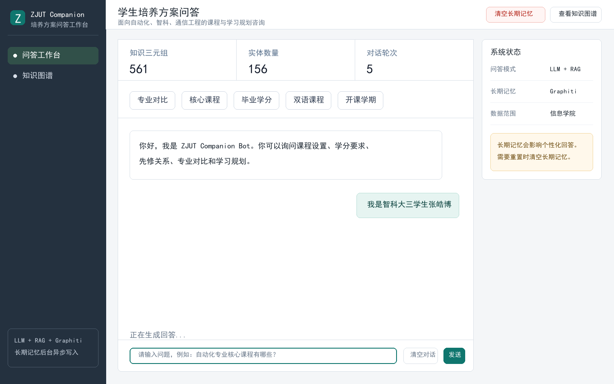
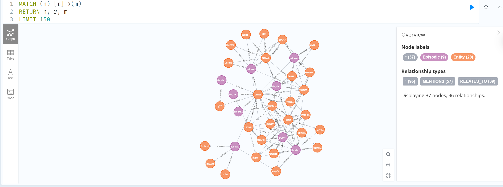
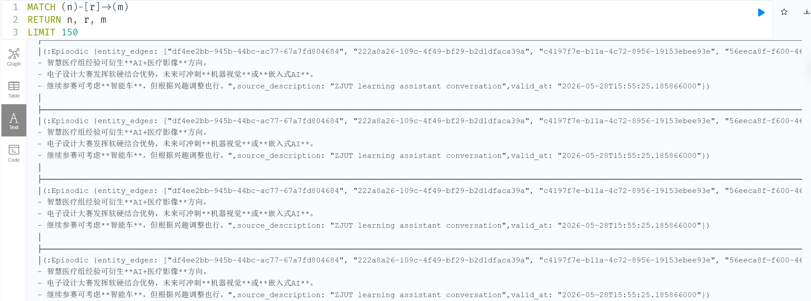

# ZJUT Companion Bot

面向浙江工业大学信息工程学院培养计划的知识图谱问答系统。项目从培养计划数据中整理课程知识图谱，支持基础规则问答、LLM-RAG 问答、本地 JSON 记忆，以及 Graphiti + Neo4j 图记忆。

<p align="center">
  <a href="https://github.com/zjunlp/OneKE"></a>
  <a href="https://github.com/getzep/graphiti"></a>
  <a href="https://neo4j.com/"></a>
  <a href="https://www.deepseek.com/"></a>
  <a href="https://dashscope.aliyun.com/"></a>
  <a href="https://flask.palletsprojects.com/"></a>
  
</p>

## 界面预览

### Web 问答工作台

当前 Web 端采用业务工作台式布局，包含统计指标、快捷问题、聊天区、系统状态面板和知识图谱入口。为避免隐私材料误上传，Web 端不暴露成绩单上传接口，仅保留清空对话和清空长期记忆。



### Neo4j 图记忆可视化

Graphiti 会把对话 episode、实体和事实边写入 Neo4j。可通过 Neo4j Browser 查看 memory graph。



### Neo4j 文本结果视图

除图视图外，也可以使用 Neo4j Browser 的文本视图检查 episode 内容、实体边和事实文本。



## 项目亮点

- **培养计划知识图谱**：围绕专业、课程、学分、学期、课程类别、先修关系、培养目标等构建结构化知识。
- **OneKE 抽取流程**：项目方法上使用 OneKE 从培养计划 PDF 抽取实体与关系；仓库内提供已整理的三元组文件便于复现。
- **基础问答版本**：不依赖 LLM，基于规则和模板回答课程、学分、先修课等问题。
- **LLM-RAG 版本**：从知识图谱检索相关三元组，拼接长期记忆上下文后调用 LLM 生成自然回答；当前本地 Web 配置可使用 DeepSeek `deepseek-v4-flash`。
- **本地 JSON 记忆**：记录学生专业、年级、兴趣、目标、薄弱课程等画像字段，作为 Graphiti 不可用时的降级方案。
- **Graphiti 图记忆升级**：将对话 episode 和实体关系写入 Neo4j，实现可查询、可视化的长期 memory graph；Web 回答先返回，记忆写入后台异步完成。
- **CLI + Web 双入口**：支持命令行问答和 Flask Web 业务工作台；Web 端保留问答、知识图谱查看、清空对话和清空长期记忆。

当前示例数据覆盖自动化、智能科学与技术、通信工程等专业。

## 系统架构

```text
培养计划 PDF / 人工整理数据
    │
    ▼
OneKE 实体/关系抽取
    │
    ▼
三元组整理与清洗
    │
    ▼
bot/data/zjut_triples_manual.json
    │
    ├── 基础 QA：QuestionParser + AnswerGenerator
    │
    └── LLM QA：RAGRetriever + LLMClient
               │
               ├── 课程知识图谱上下文
               ├── 本地 JSON Memory
               └── Graphiti Memory
                       │
                       ├── DashScope text-embedding-v3
                       ├── Qwen OpenAI-compatible extraction LLM
                       └── Neo4j Memory Graph
```

一次 Web 聊天请求的核心流程：

```text
用户问题
  → 检索课程知识图谱 RAG 上下文
  → 检索 Graphiti 长期记忆
  → 拼接 Prompt
  → 调用主问答 LLM（如 deepseek-v4-flash）
  → 返回回答给前端
  → 后台线程异步写入 Graphiti episode
```

## 目录结构

```text
.
├── README.md
├── .gitignore
├── docs/
│   └── ZJUT_Companion_Bot_Report.pdf
└── bot/
    ├── app.py
    ├── app_llm.py
    ├── manage_memory.py
    ├── check_data.py
    ├── config.example.json
    ├── requirements.txt
    ├── test_bot.py
    ├── data/
    │   ├── zjut_triples_manual.json
    │   ├── 自动化.txt
    │   ├── 智科.txt
    │   └── 通信.txt
    ├── fig/
    │   ├── web_workspace.png
    │   ├── neo4j_memory_graph.png
    │   └── neo4j_memory_text.png
    ├── src/
    │   ├── answer_generator.py
    │   ├── chatbot.py
    │   ├── graphiti_memory_store.py
    │   ├── knowledge_graph.py
    │   ├── llm_chatbot.py
    │   ├── llm_client.py
    │   ├── memory_extractor.py
    │   ├── memory_store.py
    │   ├── question_parser.py
    │   └── rag_retriever.py
    └── templates/
        ├── graph.html
        ├── index.html
        └── index_llm.html
```

## Quick Start

以下命令默认从仓库根目录执行。

### 1. 安装依赖

```bash
cd bot
python -m pip install -r requirements.txt
```

### 2. 创建本地配置

Windows PowerShell：

```powershell
Copy-Item .\config.example.json .\config.json
```

Linux / macOS：

```bash
cp config.example.json config.json
```

然后编辑 `config.json`，填入自己的 API key。`config.json` 已被 `.gitignore` 忽略，不应提交到 GitHub。

### 3. 基础问答测试

```bash
python test_bot.py
```

## 运行方式

### 基础 CLI 版本

基础版本不调用 LLM，适合快速验证知识图谱：

```bash
python test_bot.py
```

### LLM CLI 版本

```bash
python src/llm_chatbot.py
```

CLI 内置指令：

```text
memory          查看当前 memory backend 和状态
clear           清空当前对话历史
clear_memory    清空或轮换长期记忆命名空间
quit            退出
```

### LLM Web 版本

```bash
python app_llm.py
```

浏览器打开：

```text
http://localhost:5000
```

Web 端目前不提供成绩单上传或文本写入长期记忆接口。如果需要导入成绩单等本地材料，请使用本机命令行工具：

```powershell
python manage_memory.py --xlsx "D:\path\to\transcript.xlsx"
```

## Graphiti + Neo4j 配置

Graphiti 是 Python 依赖库，不需要单独启动。需要单独启动的是 Neo4j。

### 1. 启动 Neo4j

PowerShell：

```powershell
docker run -d --name zjut-graphiti-neo4j `
  -p 7474:7474 -p 7687:7687 `
  -e NEO4J_AUTH=neo4j/graphiti-zjut-2026 `
  neo4j:5.20
```

如果容器已经存在：

```bash
docker start zjut-graphiti-neo4j
docker ps --filter "name=zjut-graphiti-neo4j"
docker logs --tail 100 zjut-graphiti-neo4j
```

### 2. Neo4j Browser

访问：

```text
http://localhost:7474
```

登录：

```text
Connect URL: bolt://localhost:7687
Username: neo4j
Password: graphiti-zjut-2026
```

### 3. Memory 配置模板

`bot/config.example.json` 包含 Graphiti memory 配置：

```json
{
  "provider": "deepseek",
  "api_config": {
    "api_key": "your-deepseek-api-key",
    "model": "deepseek-v4-flash"
  },
  "memory": {
    "enabled": true,
    "group_id": "student_default",
    "neo4j_uri": "bolt://localhost:7687",
    "neo4j_user": "neo4j",
    "neo4j_password": "graphiti-zjut-2026",
    "search_limit": 8,
    "llm_api_key": "your-dashscope-api-key",
    "llm_model": "qwen-plus",
    "llm_base_url": "https://dashscope.aliyuncs.com/compatible-mode/v1",
    "embedding_provider": "dashscope",
    "embedding_model": "text-embedding-v3",
    "embedding_api_key": "your-dashscope-api-key"
  }
}
```

说明：

- `provider` / `api_config.model` 控制 Web 和 CLI 的主问答模型。
- `llm_api_key` 用于 Graphiti 内部实体与关系抽取。
- `embedding_api_key` 用于 DashScope `text-embedding-v3`。
- 主问答模型可以和 Graphiti 内部抽取模型不同；当前推荐将主问答和记忆抽取解耦。
- 当前固定 `graphiti-core==0.20.4`，便于与本地 Neo4j 5.20 环境复现。

## Neo4j 可视化 Memory

查看完整 memory graph：

```cypher
MATCH (n)-[r]->(m)
RETURN n, r, m
LIMIT 150
```

查看对话 episode：

```cypher
MATCH (e:Episodic)
RETURN e
LIMIT 50
```

查看指定 memory 命名空间：

```cypher
MATCH (n)-[r]->(m)
WHERE n.group_id = "student_default"
   OR m.group_id = "student_default"
   OR r.group_id = "student_default"
RETURN n, r, m
LIMIT 100
```

查看记忆事实文本：

```cypher
MATCH ()-[r:RELATES_TO]->()
RETURN r.fact, r.valid_at, r.group_id
LIMIT 50
```

清空本地测试图数据库：

```cypher
MATCH (n)
DETACH DELETE n
```

## 实现说明

### OneKE 到课程知识图谱

项目方法上先使用 OneKE 从培养计划 PDF 中抽取结构化信息，再做实体规范化、关系清洗和人工校验。当前仓库保留整理后的 `bot/data/zjut_triples_manual.json`，因此可跳过 PDF 抽取阶段直接复现问答流程。

### 基础 QA

基础版本通过规则解析问题意图，再从三元组中查找答案，适合回答：

- 某专业开设哪些课程？
- 某专业需要多少学分？
- 某课程的前置课程是什么？
- 某专业培养哪些能力？

### LLM-RAG

LLM 版本会先从知识图谱中检索相关三元组，再将这些三元组作为上下文传入大语言模型。这样既保留知识图谱的可靠性，也获得更自然的回答表达。

### Graphiti Memory

Graphiti 记忆将问答过程写入 Neo4j，形成 episode、实体和事实关系。后续提问时，系统会根据当前问题检索相关长期记忆，再注入 LLM prompt。

当前 Web 逻辑为“读 memory → 回答 → 后台写 memory”。这意味着用户不需要等待 Graphiti 抽取和 Neo4j 写入完成，但下一轮问题未必立刻读到上一轮刚写入的记忆。

## 报告 PDF

实验报告 PDF 已随仓库提供：

```text
docs/ZJUT_Companion_Bot_Report.pdf
```

## 开源复现说明

- `bot/config.json` 不提交，用户从 `config.example.json` 复制生成。
- `bot/data/student_memory.json` 不提交，它是运行时记忆状态。
- `__pycache__/`、`.pyc`、日志文件不提交。
- 仓库保留 `zjut_triples_manual.json`，无需重新运行 OneKE 即可复现问答流程。
- 如需复现完整数据构建流程，需要额外记录原始 PDF、OneKE 抽取 schema、抽取 prompt、后处理规则和三元组校验方式。
